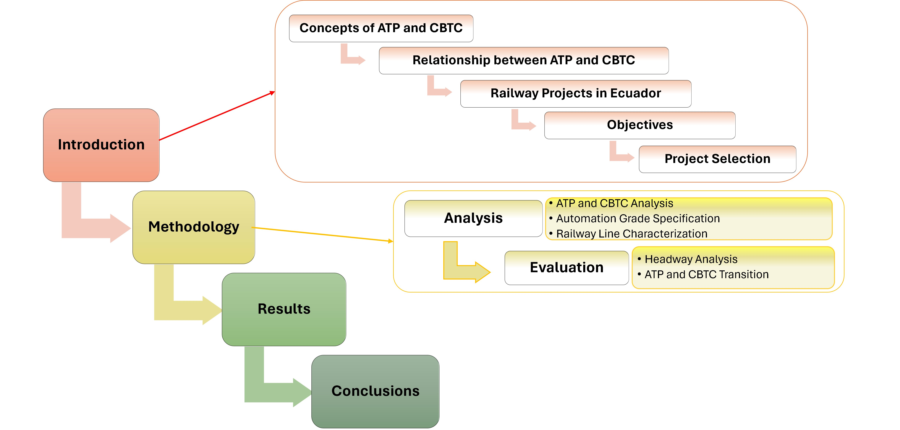

# Analyze CBTC and ATP
The document is structured as follows:
## Diagram

## Introduction
- **Concepts of ATP and CBTC**: Overview of Automatic Train Protection (ATP) and Communication-Based Train Control (CBTC) systems.
- **Relationship between ATP and CBTC**: Exploration of the interdependence between ATP and CBTC technologies.
- **Railway Projects in Ecuador**: Context and examples of relevant railway projects within Ecuador.
- **Objectives**: Definition of the main goals of the study.
- **Project Selection**: Criteria and process for selecting the railway project for analysis.

## Methodology
###Analysis:
- **ATP and CBTC Analysis**: Detailed examination of ATP and CBTC systems.
- **Automation Level Specification**: Determination of the degree of automation for the project.
- **Railway Line Characterization**: Description of the specific railway line under study.
###Evaluation:
- **Headway Analysis**: Evaluation of train intervals (headways) for the selected project.
- **ATP and CBTC Transition**: Analysis of the transition process from ATP to CBTC.

## Results
- Presentation of findings from the ATP and CBTC analysis.

## Conclusions
- Summary of the study’s key points and final conclusions.

